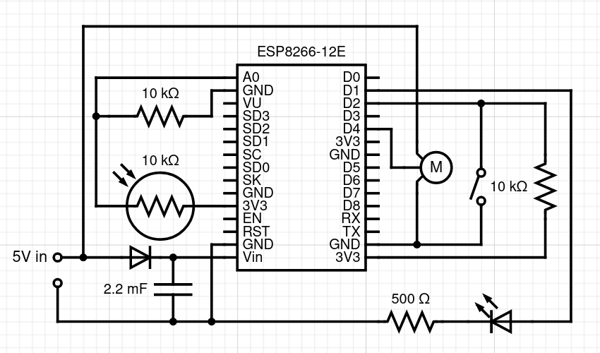

# Window blinds
Arduino-compatibile ESP8266 module's firmware for WiFi connection, photoresistor and microservos in smart-home system.

## Hardware
* 1x ESP8266-12E
* 1x Micro servo MG90S with removed potentiometer (for infinite rotation)
* 1x photoresistor 10 kOhm
* 2x resistor 10 kOhm
* 1x resistor 500 Ohm
* 1x LED
* 1x button switch

### Circut
 

### Functionalities
* WiFi connectivity, broadcast and simple management
* photoresistor's resistance measurement
* microservo calibration with LED signalling
* microservo rotation

## WiFi connectivity
To serve connectivity UDP is used. All packets are at most 5-bytes long.
### Packet structure
All packets starts with CMD byte to detect type of message. Bytes 2-5 contains additional information to provide actions.

| CMD type      | 1b    | 2b    | 3b    | 4b    | 5b    | *Description*         |
|:--------------|:-----:|:-----:|:-----:|:-----:|:-----:|:----------------------|
| CMD_BRD       | 0xF0  | ID    | ID    | 0x0   | 0x0   | *module's broadcast*  |
| CMD_SET_REQ   | 0x01  | SET   | ID\*  | ID\*  | SER\* | *set request*         |
| CMD_GET_REQ   | 0x02  | 0x0   | 0x0   | 0x0   | 0x0   | *get request*         |
| CMD_GET_RES   | 0x10  | ID    | ID    | PHR   | SER   | *get response*        |


**ID** – U16 number, module's unique ID

**SET** – set indicator; 0x1 – set microservo position, 0x10 – set ID, 0x11 – set both

**\*** – optional set parameter

**PHR** – photoresistor resistance, from 0 up to 255

**SER** – microservo position (0 - fully up, 255 - fully down)

### Connenctor.kt

To test some funcionalities you can run Connector, sample program written in Kotlin:

```kotlinc Connenctor.kt -include-runtime -d Connenctor.jar && java -jar Connenctor.jar```